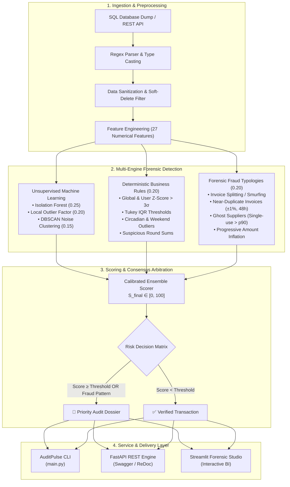

# 🔍 AuditPulse - Multi-Engine Financial Forensic & Fraud Intelligence System

[](https://anomalie-detection.streamlit.app/)
[](https://www.python.org/)
[](https://fastapi.tiangolo.com/)
[](https://streamlit.io/)
[](https://www.docker.com/)
[-brightgreen?style=for-the-badge&logo=pytest&logoColor=white)](https://docs.pytest.org/)
[](https://scikit-learn.org/)

> 🚀 **Live Demo en Ligne** : Accédez directement à l'application déployée sur Streamlit Cloud : **[https://anomalie-detection.streamlit.app/](https://anomalie-detection.streamlit.app/)**

**AuditPulse** is an enterprise-grade forensic auditing and financial anomaly detection system engineered to identify high-risk transactions, billing anomalies, and complex fraud typologies in large-scale corporate expense data.

By unifying **unsupervised machine learning**, **deterministic domain rules**, and **graph/temporal forensic fraud patterns** into a single calibrated risk score, AuditPulse captures **96.15% of total financial risk exposure** ($6.43\text{B XAF}$) while flagging only **5.91%** of audited operations.

---

## 🏛️ System Architecture

AuditPulse is designed as a modular, three-tier forensic engine:



---

## 🔬 Mathematical & Forensic Methodology

### 1. Skewness Mitigation & Power Transformations
Raw corporate expense amounts exhibit extreme positive skewness ($\gamma_1 = +68.87$) caused by multi-billion capital outlays coexisting with minor micro-expenses. Traditional Gaussian assumptions collapse under this regime.
AuditPulse applies a monotonic logarithmic stabilization:

$$\tilde{x} = \ln(1 + x)$$

This contracts skewness from **$+68.87 \to +0.23$**, restoring asymptotic normality for downstream distance metrics without altering transaction ranking order.

### 2. Contextual Anomaly Masking vs. Global Outliers
A standard global $Z$-Score:

$$Z_{\text{global}} = \frac{x - \mu_{\text{global}}}{\sigma_{\text{global}}}$$

fails to detect corporate fraud because a few multi-billion outliers inflate $\sigma_{\text{global}}$ to $>88\text{M XAF}$, masking significant employee-level embezzlement. AuditPulse implements dual-scale statistical auditing:

* **Global Z-Score ($> 3\sigma$)**: Identifies only **2** extreme systemic outliers.
* **Contextual User Z-Score ($> 3\sigma_{\text{user}}$)**: Identifies **74** high-confidence departmental anomalies that exploit local trust.

### 3. The Ensemble Scoring Formula
Every transaction receives an integrated risk score $S_{\text{final}} \in [0.0, 1.0]$:

$$S_{\text{final}} = w_{\text{IF}} S_{\text{IF}} + w_{\text{LOF}} S_{\text{LOF}} + w_{\text{DBSCAN}} S_{\text{DBSCAN}} + w_{\text{Rules}} S_{\text{Rules}} + w_{\text{Fraud}} S_{\text{Fraud}}$$

$$\sum_{i} w_i = 0.25 + 0.20 + 0.15 + 0.20 + 0.20 = 1.00$$

Transactions are elevated to the **Priority Forensic Queue** if:
1. $S_{\text{final}} \ge \tau_{\text{decision}}$ (Calibrated 95th percentile $\approx 0.231 - 0.50$), **OR**
2. An explicit forensic fraud pattern is confirmed ($I_{\text{fraud}} = 1$), **OR**
3. Multi-model consensus is achieved ($\ge 2$ ML detectors evaluate $S > 0.70$).

---

## 📊 Real Audit Results & Financial Impact

On the benchmark enterprise dataset (anonymized real-world production expenses):

| Metric | Measured Value | Significance |
| :--- | :--- | :--- |
| **Total Audited Operations** | **4,772** transactions | Complete historical scope |
| **Total Audited Capital** | **6,686,155,196.39 XAF** (~$10.2M) | Gross expenditure volume |
| **Flagged Audit Anomalies** | **282** transactions (**5.91%**) | Minimal investigator fatigue |
| **Financial Exposure Captured** | **6,428,540,001.21 XAF** (**96.15%**) | Maximum capital protection |
| **Global Population Mean Score** | **0.1420 / 1.0000** | Healthy transactions cluster low |
| **Anomalies Mean Risk Score** | **0.3514 / 1.0000** | Clear separation margin ($> 2.47\times$) |

### Top Forensic Case Studies Uncovered
* **Case 1 (Serial Behavioral Deviation - `USR_0109`)**: Employee systematically submitted round invoices (`6,756,000 XAF`, `1,400,000 XAF`, `315,525 XAF`) off-hours via direct dashboard access, triggering 4 simultaneous rule violations and high Local Outlier Factor scores (Risk: **73.5%**).
* **Case 2 (Extreme Channel Outlier - `EXP_03514`)**: A single purchase of `6,051,453,317 XAF` routed through a social messaging channel (`FACEBOOK`), isolated as an unclustered noise anomaly by DBSCAN and global Z-Score (Risk: **63.7%**).
* **Case 3 (Invoice Splitting Rings)**: 8 distinct operations split beneath manager approval thresholds within 24-hour windows towards identical vendor accounts.

---

## 📁 Repository Structure

```text
anomalie_detection/
├── api/                           # FastAPI REST Service
│   ├── routes/
│   │   ├── health.py              # System health & model registry probe
│   │   └── anomalies.py           # Single-record & batch scoring endpoints
│   ├── main.py                    # App entrypoint & CORS middleware
│   └── schemas.py                 # Pydantic v2 input/output validation
├── dashboard/                     # Streamlit Forensic Studio
│   └── app.py                     # Interactive BI dashboard, KPI cards, visual charts
├── data/                          # Anonymized data assets
│   └── auditpulse_expenses.sql    # Cleaned, anonymized benchmark SQL dump
├── notebooks/                     # Interactive Research & Validation
│   └── notebooks/
│       └── auditpulse_anomaly_detection.ipynb # 14-step forensic discovery notebook
├── scripts/                       # Maintenance & ETL scripts
│   └── anonymize_data.py          # Deterministic ULID anonymization & temporal shifting
├── src/                           # Core Algorithmic Framework
│   ├── config.py                  # Central configuration & hyperparameters
│   ├── data_loader.py             # Robust MySQL dump parser & typings
│   ├── model_registry.py          # Central singleton model registry & inference engine
│   ├── preprocessing.py           # Temporal, user behavior & supplier feature engineering
│   ├── scorer.py                  # Ensemble scoring orchestrator
│   ├── models/                    # Detection Engines
│   │   ├── dbscan.py              # Density-based spatial noise clustering
│   │   ├── fraud_patterns.py      # Smurfing, duplicates, ghost suppliers, inflation
│   │   ├── isolation_forest.py    # Multi-dimensional tree isolation
│   │   ├── lof.py                 # Local Outlier Factor density estimator
│   │   └── rule_based.py          # 8 deterministic expert business rules
│   └── utils/
│       └── logger.py              # Structured, thread-safe console logging
├── tests/                         # Automated Pytest Suite (53 Tests)
│   ├── conftest.py                # Shared synthetic data fixtures
│   ├── test_api.py                # REST API endpoints & payload contracts
│   ├── test_cli.py                # CLI argument parsing & subcommands
│   ├── test_data_loader.py        # SQL parser, JSON extraction, error handling
│   ├── test_fraud_patterns.py     # 4 forensic fraud pattern algorithms
│   ├── test_models.py             # IF, LOF, DBSCAN fit/predict contracts
│   ├── test_preprocessing.py      # Feature engineering & 0-NaN guarantees
│   ├── test_rules.py              # 8 deterministic business rules
│   └── test_scorer.py             # Full pipeline orchestration & top-N ranking
├── Dockerfile                     # Multi-stage production container
├── docker-compose.yml             # Orchestration for API + Dashboard services
├── main.py                        # Unified command-line interface (CLI)
├── pytest.ini                     # Pytest runner configuration
└── requirements.txt               # Pinned project dependencies
```

---

## 🚀 Quickstart Guide

### 1. Local Environment Setup

```bash
# Clone the repository
git clone https://github.com/your-username/auditpulse.git
cd auditpulse

# Initialize virtual environment
python -m venv .venv
source .venv/bin/activate  # On Windows: .venv\Scripts\activate

# Install dependencies
pip install --upgrade pip
pip install -r requirements.txt
```

### 2. Unified CLI Usage (`main.py`)

AuditPulse provides a root CLI for all operations:

```bash
# Run a full forensic audit and display the Top 10 critical dossiers
python main.py audit --top 10

# Export audit findings to CSV, Parquet, or JSON
python main.py audit --top 20 --output reports/audit_dossier.csv

# Launch the FastAPI REST Server (Swagger on http://localhost:8000/docs)
python main.py api --port 8000 --reload

# Launch the Streamlit Forensic Studio (http://localhost:8501)
python main.py dashboard --port 8501

# Anonymize a raw SQL production dump
python main.py anonymize --input raw_dump.sql --output data/auditpulse_expenses.sql --shift-days 70
```

### 3. Containerized Deployment (Docker Compose)

Launch the complete stack (FastAPI Backend + Streamlit UI) with a single command:

```bash
docker compose up -d --build
```

* **FastAPI Swagger Docs**: [http://localhost:8000/docs](http://localhost:8000/docs)
* **Streamlit Forensic Studio (Local)**: [http://localhost:8501](http://localhost:8501)
* **Streamlit Community Cloud (Live)**: [https://anomalie-detection.streamlit.app/](https://anomalie-detection.streamlit.app/)
* **Health Check**: `curl -f http://localhost:8000/api/v1/health`

---

## 🧪 Automated Testing & CI/CD Verification

The repository includes a comprehensive, modular `pytest` test suite:

```bash
pytest -v
```

```text
tests/test_api.py .................................. PASSED [ 11%]
tests/test_cli.py .................................. PASSED [ 16%]
tests/test_data_loader.py .......................... PASSED [ 35%]
tests/test_fraud_patterns.py ....................... PASSED [ 45%]
tests/test_models.py ............................... PASSED [ 62%]
tests/test_preprocessing.py ........................ PASSED [ 79%]
tests/test_rules.py ................................ PASSED [ 94%]
tests/test_scorer.py ............................... PASSED [100%]

======================= 53 passed in 30.88s (100%) ========================
```

---

## 🔒 Data Privacy & Anonymization Guarantees

AuditPulse was developed with strict compliance standards for public research and open demonstrations:

1. **Irreversible Bijective Mapping**: All production ULIDs (`expenses`, `companies`, `users`, `shops`, `suppliers`) were deterministically mapped to synthetic identifiers (`EXP_xxxxx`, `USR_xxxx`, `SUPP_xxxx`).
2. **Deep JSON Sanitization**: Nested JSON payloads (`billing`, `metadata`, `shipping`) were purged of internal treasury accounts (`ACC_xxxx`), addresses, and private recipient labels.
3. **Harmonic Temporal Displacement**: All timestamps were shifted by $+70$ days (an exact multiple of 7). This ensures $100\%$ mathematical preservation of:
   * Day-of-week distributions and weekend indicators (`is_weekend`),
   * Intraday circadian curves and off-hours behavior (`is_outside_hours`),
   * Temporal fraud windows (24h splitting, 48h invoice duplicates, 7-day rolling trends),
   while preventing any reverse-correlation with live production systems.

---

## 📜 License & Credits

* **Engine Architecture & Implementation**: Built with Python, Scikit-Learn, FastAPI & Streamlit.
* **License**: MIT License — free for academic, enterprise research, and portfolio demonstration.
